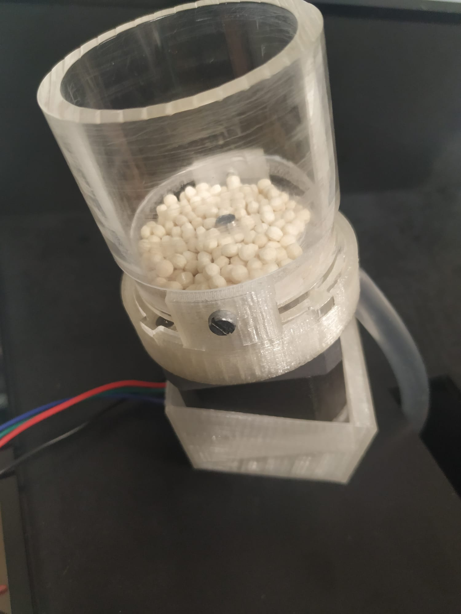

# Hardware for implementing behavioural experiments using pyControl.

The folder contains design files of a custom-made pellet dispenser for delivering 20mg Dustless Precission Pellets (Bio-Serv) in behavioural experiments with mice. Built on a NEMA-17 stepper motor.
The folder contains .stl files for 3D printing of different components. As well as some .pdf files used to laser-cut some acrylic components. It contains a [.PDF file](Pellet-Dispenser-Design-Files/MOUNTING pellet dispenser.pdf) with the setps to follow in order to mount the pellet dispenser. 

There are some extra .stl files. One of the food-magazine used to hold the delivered pellets from where mice can grab them. The design is compatible with a pyControl poke device to detect pellet arrival and retrieval. And another one which was used to hold 2 pellet dispensers together in a wall. 
